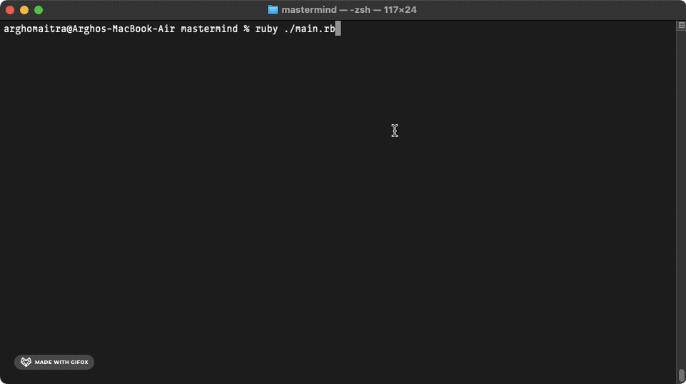
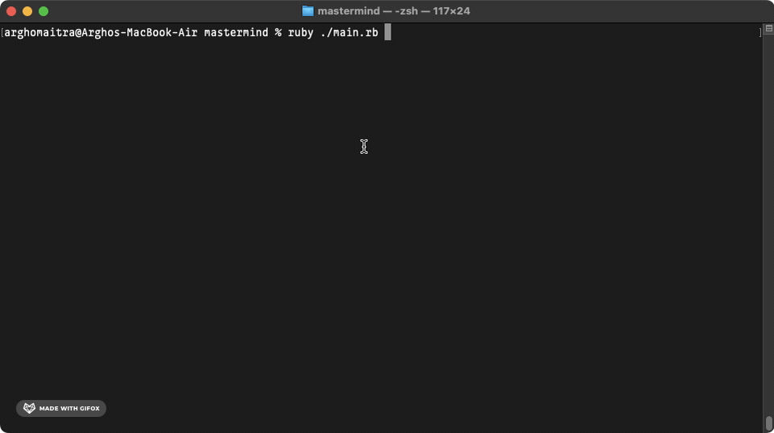

# mastermind
Play the Mastermind Game on the Terminal

## Demo

## General Info

**mastermind** is the [sixth project](https://www.theodinproject.com/lessons/ruby-mastermind) in the [Ruby Course](https://www.theodinproject.com/paths/full-stack-ruby-on-rails/courses/ruby) from the [Full Stack Ruby on Rails](https://www.theodinproject.com/paths/full-stack-ruby-on-rails) path in the [The Odin Project](https://www.theodinproject.com/about).

Here, I create a command line version of mastermind. This is a game where you have to guess your opponent's secret code within a certain number of turns (like hangman with colored pegs). Each turn you get some feedback about how good your guess was - whether it was exactly correct or just the correct color but in the wrong space.

## Technologies

+ ***CLI***
+ ***Git***
+ ***GitHub***
+ ***Ruby***

## Self-reflections

> This felt even harder than the [Tic-tac-toe project](https://github.com/mitrohgr/tic_tac_toe). The difficulty of mastermind was elevated mainly because I had a trouble of doing it the OOP way. At first, I couldn't see as to why would this project require classes and methods. But the more I brainstormed, the more it became clear that doing it the OOP way is actually easier than the normal way (non-OOP way).

> I learned quite a great deal of stuff like the object model, how classes define objects, modules, states and behaviors, instance variables and methods, accessor methods, class variables and methods, constants, to_s method, self, inheritance, mixing in modules, method lookup path, private, protected and public, and finally accidental method overriding.

> I also learned a lot of new things like splitting code into separate files, namespace and scope of required files, development dependencies, gems, bundler, Ruby LSP VSCode extension, linting, formatting, use of RuboCop and its installation and configuration, interaction of RuboCop with Ruby LSP and VSCode, and finally all its major metrics.

> [!NOTE]
> More problems arose because of the following points: (1) I had never played this game in my entire life and it wasn't a part of my childhood, (2) it took a considerable amount of time to learn the specified [rules of the game](https://www.wikihow.com/Play-Mastermind), and (3) it took a gigantic amount of perseverance and grit to push through and actually implement the [algorithms](https://en.wikipedia.org/wiki/Mastermind_(board_game)#Algorithms_and_strategies) and [strategies](https://puzzling.stackexchange.com/a/8884) mentioned in the specifications. During this entire time, stack overflow, google, and the TOP's discord were my best friends.

## Contact and Support

+ Feel free to contact ***mitrohgr_03505*** on discord for project-related queries.
+ No further feature modifications or improvements will be done to this project.
